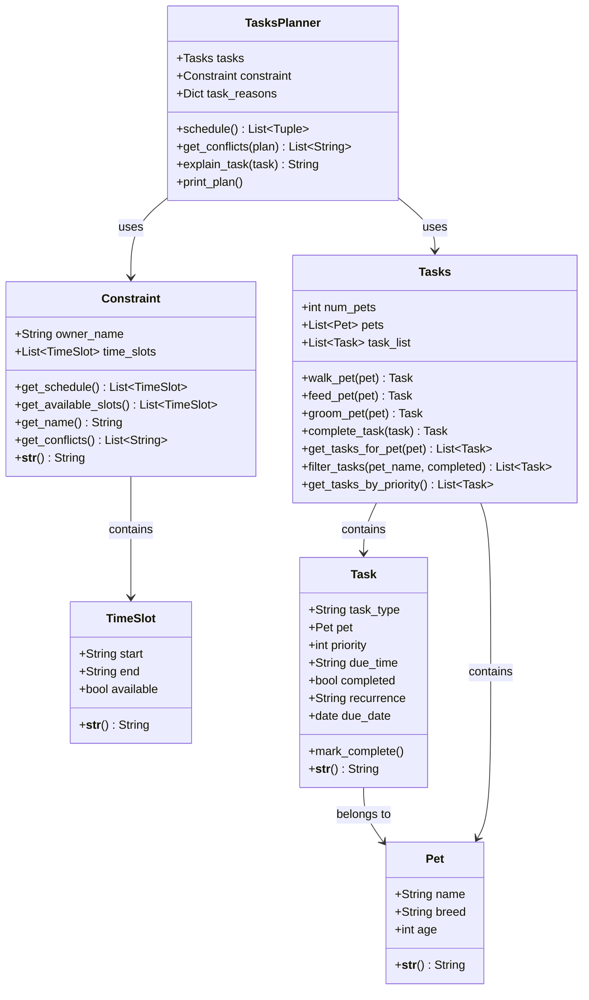

# PawPal+ Project Reflection

## 1. System Design

**a. Initial design**

- Briefly describe your initial UML design.
- What classes did you include, and what responsibilities did you assign to each?

For this program, we need the following three core actions:
* Track tasks, such as walking, feeding, grooming, and so on.
* Consider constraints, such as time availability, priority, and so on.
* Tasks Planner and explain the reason for each task.

The following objects are my initial design of the UML:
* Tasks Class: it has attributes such as the number of pets, the name of pets, and name of tasks. It has methods such as walkPet(), feedPet(), groomPet(), and so on. 
* Constraint Class: it has attributes such as the pet owner's name, the pet owner's time schedule, and it has methods such as getSchedule(), getName(), toString().
* Tasks Planner: it will instantiate the Tasks Class and the Constraint Class and use their methods to build up the plan for the pet owner. It has attributes like the reasons of each task. It has methods such as explainTask().

**b. Design changes**

- Did your design change during implementation?
- If yes, describe at least one change and why you made it.

* Based on the AI agend examination result, I decided to add some new classes such as Pet, TimeSlot, and Task. This is because the previous tasks (Tasks, Constraint, TasksPlanner) are not holding the right attributes or missing the needed objects, such as Pet.
---

## 2. Scheduling Logic and Tradeoffs

**a. Constraints and priorities**

- What constraints does your scheduler consider (for example: time, priority, preferences)?

The scheduler in pawpal_system.py considers three constraints:

* Availability — Constraint.get_available_slots() filters out any TimeSlot where available=False before scheduling begins. Busy windows (commute, meetings) are never assigned a task.

* Priority — Tasks.get_tasks_by_priority() sorts tasks by priority integer (1 = highest) before they're paired with slots. Lower-priority tasks only get a slot after all higher-priority ones are placed.

* Time-of-day preference — the secondary sort key maps due_time strings ("morning", "afternoon", "evening", "anytime") to a numeric order, so same-priority tasks are further ordered by when they should ideally happen.

Due date (task.due_date) is visible in output but not yet used as a sort/filter constraint — tasks for tomorrow can appear in today's schedule if they're in the task list.

- How did you decide which constraints mattered most?

Availability is non-negotiable — the owner simply cannot act during a busy slot, so it's enforced by exclusion before any ranking happens. Priority comes next because pet care tasks have real health consequences: feeding is P1 because a missed meal affects the animal directly, walking is P2 because it's important but flexible, grooming is P3 because skipping one session is harmless. Time-of-day preference is last because it's advisory — a feed task ideally happens in the morning, but if the only open slot is at noon it's still better than nothing. That ordering (hard constraint → health priority → soft preference) reflects how a real pet owner would make the same call.

**b. Tradeoffs**

- Describe one tradeoff your scheduler makes.
- Why is that tradeoff reasonable for this scenario?

schedule() in pawpal_system.py:212 uses a single zip pass — it pairs the highest-priority task with the earliest available slot, the second task with the second slot, and so on. It never backtracks or tries alternate slot combinations. If a P1 feed task is due in the morning but the first available slot is at 18:00, it still gets assigned there.

---

## 3. AI Collaboration

**a. How you used AI**

- How did you use AI tools during this project (for example: design brainstorming, debugging, refactoring)?

* I used the AI agent to help me refine my UML design, such as adding missing objects, missing attributes, missing methods, and so on. Also, it helps me draft test file cases and documents any code modifications. Besides all of those, it also refactored the code and make the structure more clean and tidy.

- What kinds of prompts or questions were most helpful?

* Usually very specific promts or questions are very important, such as providing features, like #file: XXX or #codebase. They help the AI to better understand the task.

**b. Judgment and verification**

- Describe one moment where you did not accept an AI suggestion as-is.

* In pawpal_system.py, the AI generated two methods that have the same name (get_conflics()), and this is kind of misleading to code readers, so I asked the AI to solve this by renaming them with better names.

- How did you evaluate or verify what the AI suggested?

* I will read through AI suggestions carefully and also rely on the test cases to see if the code generated by AI is actually working.
---

## 4. Testing and Verification

**a. What you tested**

**What behaviors did you test?**

Five categories of behavior were tested:

1. **Task completion** — `test_mark_complete_changes_status` verifies that a task starts with `completed=False` and flips to `True` after `mark_complete()` is called.
2. **Task addition** — `test_feed_pet_increases_task_count` confirms that calling `feed_pet()`, `walk_pet()`, and `groom_pet()` each appends exactly one task to `task_list`, growing it from 0 to 3.
3. **Sorting correctness** — Two tests cover `get_tasks_by_priority()`: one checks that tasks added out of order (groom P3, walk P2, feed P1) come back sorted P1→P2→P3; the other checks that tasks at the same priority are further sorted by due_time (morning before evening).
4. **Recurrence logic** — `test_complete_daily_task_creates_next_day_task` checks that completing a daily recurring task appends a new task due the next day with the same type and recurrence, while `test_complete_non_recurring_task_returns_none` checks that completing a one-off task returns `None` and adds nothing to the list.
5. **Conflict detection** — Two tests cover `get_slot_overlaps()`: one asserts that overlapping slots (09:00–10:00 and 09:30–10:30) produce exactly one conflict message referencing both start times, and the other asserts that adjacent slots (08:00–09:00 and 09:00–10:00) produce no conflict.

**Why were these tests important?**

Each test targets a distinct contract that the rest of the system depends on. If `mark_complete()` did not set `completed=True`, the scheduler would never know a task was done. If sorting were wrong, lower-priority tasks could get assigned the best time slots ahead of higher-priority ones, breaking the core scheduling guarantee. Recurrence tests matter because a missed spawn means a daily feeding task silently disappears after one completion. Conflict detection tests protect the owner from being double-booked — if overlapping slots were not caught, two tasks could be scheduled at the same time with no warning. Together they give confidence that the building blocks of the system are correct before wiring them together in the UI.

**b. Confidence**

**How confident are you that your scheduler works correctly?**

Moderately confident. The building blocks (`mark_complete`, task creation, sorting, recurrence, conflict detection) are each unit-tested and behave correctly in isolation. However, `TasksPlanner.schedule()` itself has no direct tests — the test suite never constructs a `TasksPlanner`, calls `schedule()`, and asserts on the result. That means the integration between `Tasks`, `Constraint`, and `TasksPlanner` is only verified manually by running the app or the `__main__` demo. If a bug existed in how slots are paired with tasks, the current tests would not catch it.

**What edge cases would you test next if you had more time?**

1. **More tasks than available slots** — `schedule()` uses `zip`, which silently drops any tasks beyond the number of open slots. A test should verify that the unscheduled count is correct and that no task is lost without warning.
2. **No available slots at all** — if every `TimeSlot` has `available=False`, `schedule()` should return an empty list. Worth asserting explicitly rather than relying on the UI warning.
3. **All tasks at the same priority** — the sort falls back entirely to `due_time` order. A test with three same-priority tasks (morning, evening, afternoon) would confirm they come out morning → afternoon → evening.
4. **`filter_tasks` with both filters active** — the current tests only exercise `filter_tasks` indirectly. A test combining `pet_name` and `completed=True` would confirm both filters apply together correctly.
5. **Overlapping slots marked `available=False`** — `get_slot_overlaps` only checks available slots. A test with two busy overlapping slots should return zero conflicts, confirming busy slots are correctly excluded.
6. **Weekly recurrence** — `complete_task` handles `"weekly"` but only daily recurrence is tested. A parallel test for weekly should verify `due_date` advances by 7 days.

---

## 5. Reflection

**a. What went well**

- What part of this project are you most satisfied with?

The process of actually building an usable app from the scratch while using the AI tools. It better helped me to understand the role of AI tools in this process.

**b. What you would improve**

- If you had another iteration, what would you improve or redesign?

I would design my UML betther at first so that the AI can use it to generate high quality code files, instead of modifying the overall structure in a big step.

**c. Key takeaway**

- What is one important thing you learned about designing systems or working with AI on this project?

One big takeaway I learned in this project is that AI can not test the usibility of code in the destination terminal, such as the web browser. We need to test the code usibility by actually acting as an user to use the website to see if there are any bugs in the code. 
