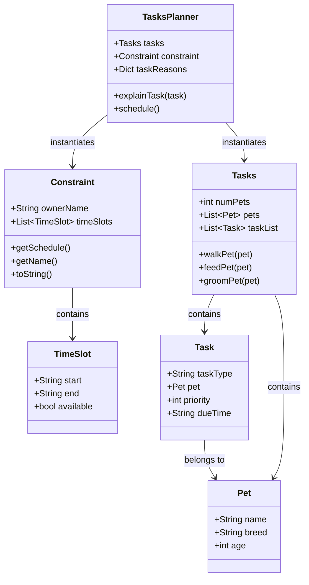

# PawPal+ Project Reflection

## 1. System Design

**a. Initial design**

- Briefly describe your initial UML design.
- What classes did you include, and what responsibilities did you assign to each?

For this program, we need the following three core actions:
* Track tasks, such as walking, feeding, grooming, and so on.
* Consider constraints, such as time availability, priority, and so on.
* Tasks Planner and explain the reason for each task.

The following objects are my initial design of the UML:
* Tasks Class: it has attributes such as the number of pets, the name of pets, and name of tasks. It has methods such as walkPet(), feedPet(), groomPet(), and so on. 
* Constraint Class: it has attributes such as the pet owner's name, the pet owner's time schedule, and it has methods such as getSchedule(), getName(), toString().
* Tasks Planner: it will instantiate the Tasks Class and the Constraint Class and use their methods to build up the plan for the pet owner. It has attributes like the reasons of each task. It has methods such as explainTask().

**b. Design changes**

- Did your design change during implementation?
- If yes, describe at least one change and why you made it.

Based on the AI agend examination result, I decided to add some new classes such as Pet, TimeSlot, and Task. This is because the previous tasks (Tasks, Constraint, TasksPlanner) are not holding the right attributes or missing the needed objects, such as Pet.
---

## 2. Scheduling Logic and Tradeoffs

**a. Constraints and priorities**

- What constraints does your scheduler consider (for example: time, priority, preferences)?

The scheduler in pawpal_system.py considers three constraints:

* Availability — Constraint.get_available_slots() filters out any TimeSlot where available=False before scheduling begins. Busy windows (commute, meetings) are never assigned a task.

* Priority — Tasks.get_tasks_by_priority() sorts tasks by priority integer (1 = highest) before they're paired with slots. Lower-priority tasks only get a slot after all higher-priority ones are placed.

* Time-of-day preference — the secondary sort key maps due_time strings ("morning", "afternoon", "evening", "anytime") to a numeric order, so same-priority tasks are further ordered by when they should ideally happen.

Due date (task.due_date) is visible in output but not yet used as a sort/filter constraint — tasks for tomorrow can appear in today's schedule if they're in the task list.

- How did you decide which constraints mattered most?

Availability is non-negotiable — the owner simply cannot act during a busy slot, so it's enforced by exclusion before any ranking happens. Priority comes next because pet care tasks have real health consequences: feeding is P1 because a missed meal affects the animal directly, walking is P2 because it's important but flexible, grooming is P3 because skipping one session is harmless. Time-of-day preference is last because it's advisory — a feed task ideally happens in the morning, but if the only open slot is at noon it's still better than nothing. That ordering (hard constraint → health priority → soft preference) reflects how a real pet owner would make the same call.

**b. Tradeoffs**

- Describe one tradeoff your scheduler makes.
- Why is that tradeoff reasonable for this scenario?

schedule() in pawpal_system.py:212 uses a single zip pass — it pairs the highest-priority task with the earliest available slot, the second task with the second slot, and so on. It never backtracks or tries alternate slot combinations. If a P1 feed task is due in the morning but the first available slot is at 18:00, it still gets assigned there.

---

## 3. AI Collaboration

**a. How you used AI**

- How did you use AI tools during this project (for example: design brainstorming, debugging, refactoring)?
- What kinds of prompts or questions were most helpful?

**b. Judgment and verification**

- Describe one moment where you did not accept an AI suggestion as-is.
- How did you evaluate or verify what the AI suggested?

---

## 4. Testing and Verification

**a. What you tested**

- What behaviors did you test?
- Why were these tests important?

**b. Confidence**

- How confident are you that your scheduler works correctly?
- What edge cases would you test next if you had more time?

---

## 5. Reflection

**a. What went well**

- What part of this project are you most satisfied with?

**b. What you would improve**

- If you had another iteration, what would you improve or redesign?

**c. Key takeaway**

- What is one important thing you learned about designing systems or working with AI on this project?
