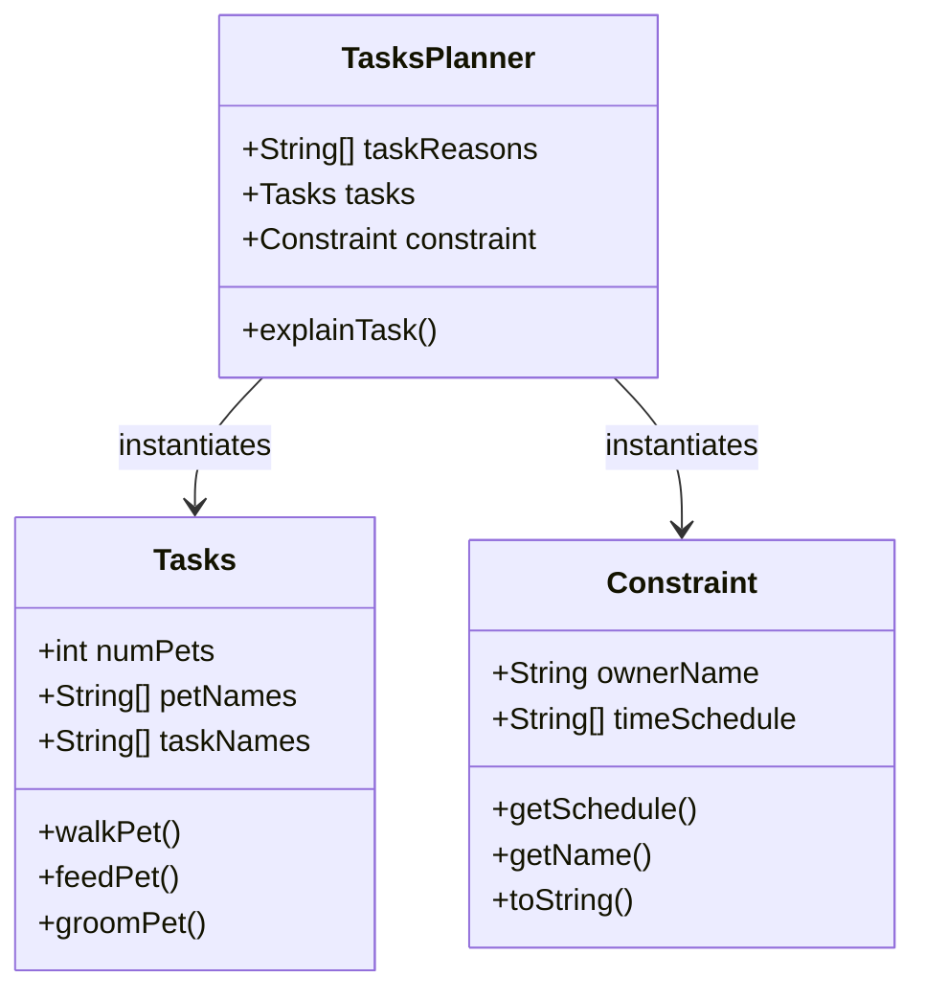

# PawPal+ Project Reflection

## 1. System Design

**a. Initial design**

- Briefly describe your initial UML design.
- What classes did you include, and what responsibilities did you assign to each?

For this program, we need the following three core actions:
* Track tasks, such as walking, feeding, grooming, and so on.
* Consider constraints, such as time availability, priority, and so on.
* Tasks Planner and explain the reason for each task.

The following objects are my initial design of the UML:
* Tasks Class: it has attributes such as the number of pets, the name of pets, and name of tasks. It has methods such as walkPet(), feedPet(), groomPet(), and so on. 
* Constraint Class: it has attributes such as the pet owner's name, the pet owner's time schedule, and it has methods such as getSchedule(), getName(), toString().
* Tasks Planner: it will instantiate the Tasks Class and the Constraint Class and use their methods to build up the plan for the pet owner. It has attributes like the reasons of each task. It has methods such as explainTask().

**b. Design changes**

- Did your design change during implementation?
- If yes, describe at least one change and why you made it.

---

## 2. Scheduling Logic and Tradeoffs

**a. Constraints and priorities**

- What constraints does your scheduler consider (for example: time, priority, preferences)?
- How did you decide which constraints mattered most?

**b. Tradeoffs**

- Describe one tradeoff your scheduler makes.
- Why is that tradeoff reasonable for this scenario?

---

## 3. AI Collaboration

**a. How you used AI**

- How did you use AI tools during this project (for example: design brainstorming, debugging, refactoring)?
- What kinds of prompts or questions were most helpful?

**b. Judgment and verification**

- Describe one moment where you did not accept an AI suggestion as-is.
- How did you evaluate or verify what the AI suggested?

---

## 4. Testing and Verification

**a. What you tested**

- What behaviors did you test?
- Why were these tests important?

**b. Confidence**

- How confident are you that your scheduler works correctly?
- What edge cases would you test next if you had more time?

---

## 5. Reflection

**a. What went well**

- What part of this project are you most satisfied with?

**b. What you would improve**

- If you had another iteration, what would you improve or redesign?

**c. Key takeaway**

- What is one important thing you learned about designing systems or working with AI on this project?
